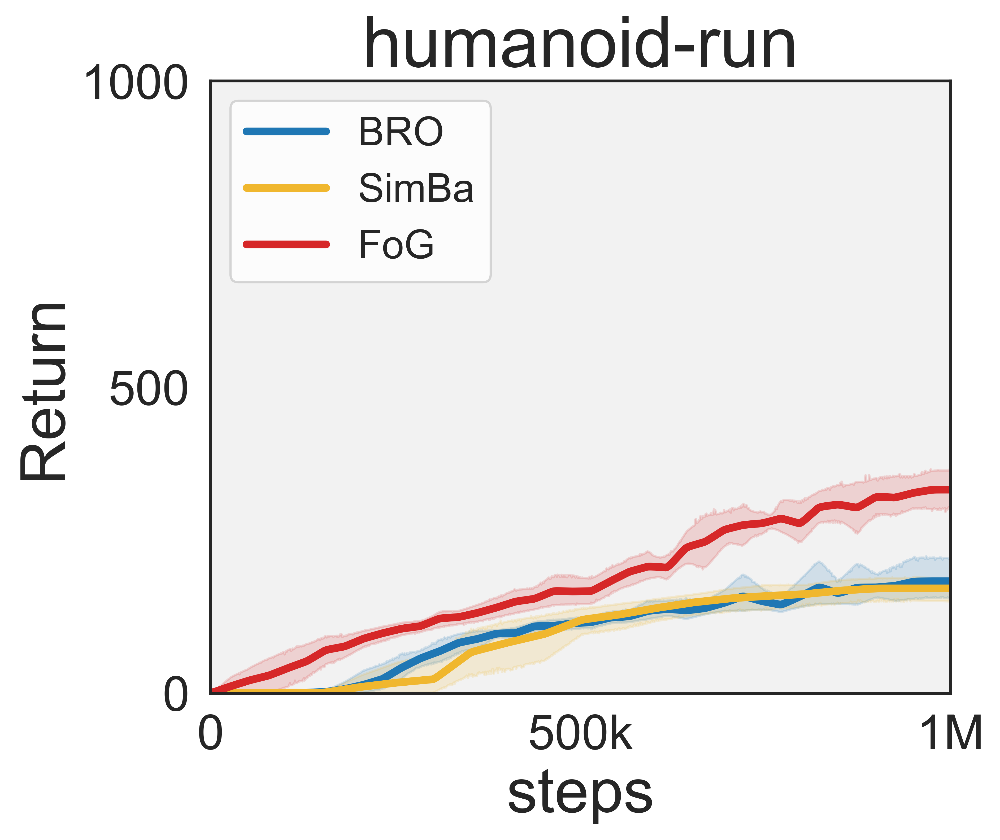
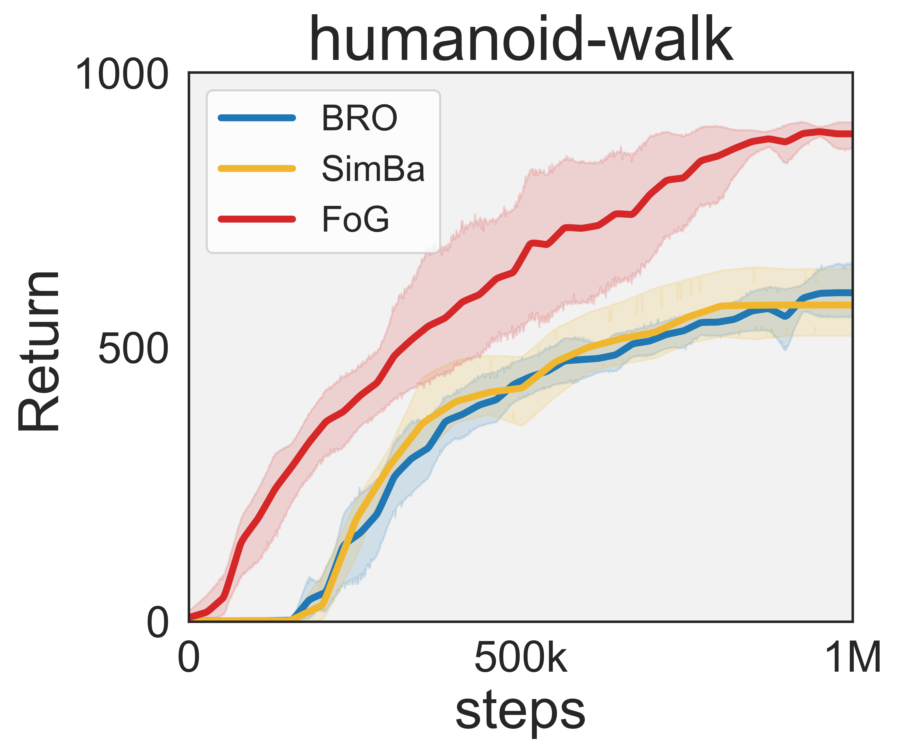
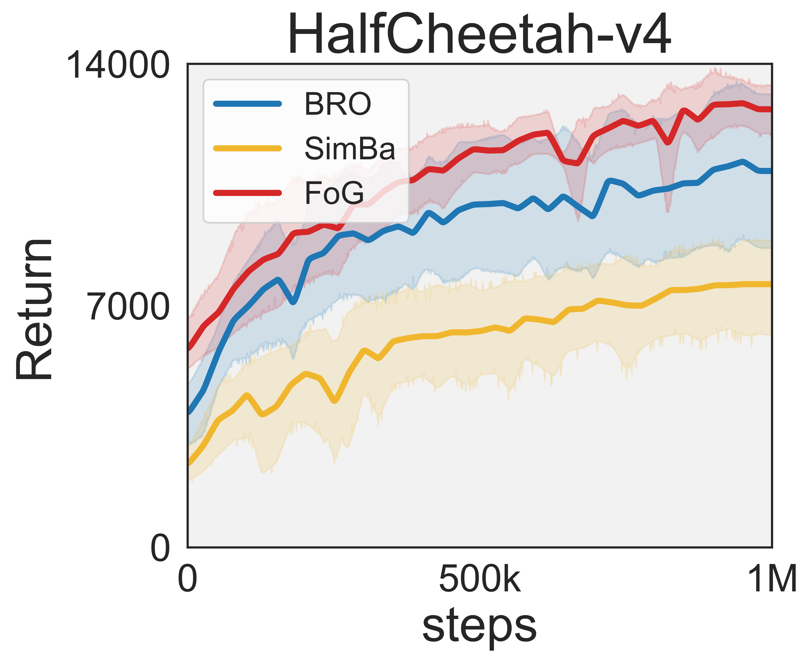

# FoG with No Resets Experiment Results

  
  
  

  This experiment was conducted to evaluate the performance of the FoG algorithm with no resets on dmc humanoid tasks and gym HalfCheetah-v4. The results are shown in the figures above. We use FoG with no resets, compared to BRO and SimBa (also with no resets). We use depth=10 (~42M params) for BRO and SimBa, which is almost twice the number of parameters of a maximal depth FoG model. All methods use a replay ratio of 2. While BRO and SimBa consume almost 2x computation compared to FoG, FoG still outperforms them in terms of sample efficiency. 

